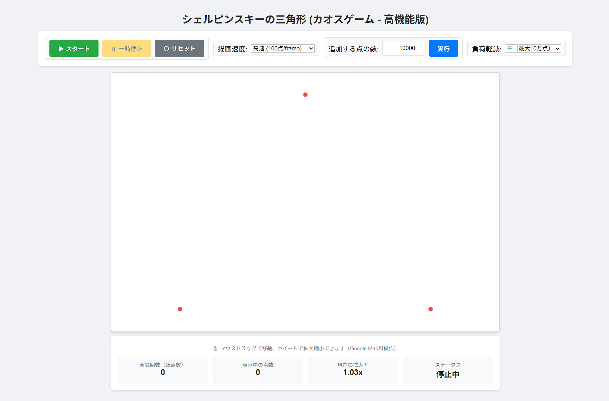
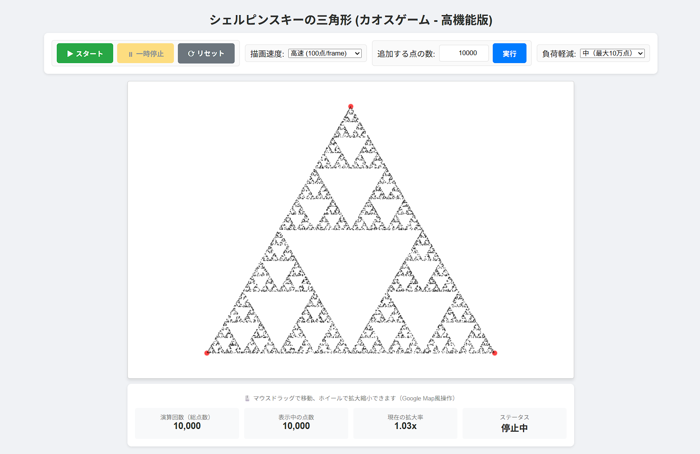
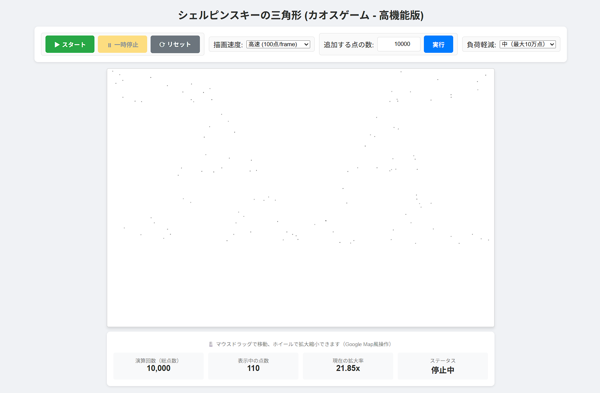
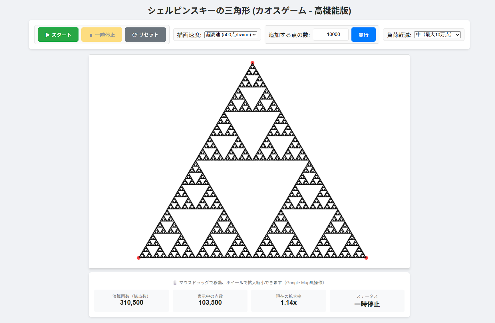

# Sierpinski Triangle - Chaos Game (Advanced Version)

An interactive web application that generates the Sierpinski Triangle using the Chaos Game algorithm, featuring Google Maps-like pan and zoom controls with performance optimizations.

## Features

### Control Buttons
- **▶ Start**: Begin continuous point generation animation
- **⏸ Pause**: Pause the running animation
- **⟳ Reset**: Clear all points and reset the view

### Drawing Speed
Select the number of points calculated per animation frame:
- Slow (1 point/frame)
- Normal (10 points/frame)
- Fast (100 points/frame) - Default
- Ultra Fast (500 points/frame)

### Batch Execution
- Enter a specific number of points to add
- Click "Execute" to add all points at once
- Large batches (>50,000 points) are processed asynchronously to prevent UI blocking

### Load Reduction
Configurable point rendering limits to maintain smooth performance:
- **OFF (All Points)**: No limit - render all calculated points
- **Low (Max 500k points)**: Light reduction
- **Medium (Max 100k points)**: Moderate reduction - Default
- **High (Max 20k points)**: Heavy reduction for slower devices

### Pan & Zoom (Google Maps-style)
- **Mouse Drag**: Pan/move the view
- **Mouse Wheel**: Zoom in/out centered on cursor position
- **Touch Drag**: Pan on mobile devices
- **Pinch to Zoom**: Two-finger zoom on touch devices

### Statistics Display
- **Total Points**: Number of calculated points (iterations)
- **Visible Points**: Number of currently rendered points
- **Zoom Level**: Current magnification ratio
- **Status**: Current operation state

## Algorithm

The Sierpinski Triangle is generated using the Chaos Game method:

1. Define three vertices of an equilateral triangle
2. Start from a random point inside the triangle
3. Randomly select one of the three vertices
4. Move halfway between the current point and the selected vertex
5. Plot the new position
6. Repeat steps 3-5 indefinitely

This simple iterative process produces the famous fractal pattern.

## Performance Optimizations

- **Viewport Culling**: Only points within the visible area are rendered
- **Point Thinning**: When total points exceed the load reduction threshold, points are uniformly skipped
- **Chunked Storage**: Points are stored in 10,000-element chunks for memory efficiency
- **Async Batching**: Large point additions are processed in batches to prevent UI freezing

## Screenshots

### Initial State

### With 10,000 Points

### Zoomed View

### Load Reduction Control

The number of calculations differs from the total number of points displayed.

## Usage

Simply open `Sierpinski_3.html` in a web browser. No server or build process required.

## Browser Support

Works in all modern browsers that support HTML5 Canvas:
- Chrome
- Firefox
- Safari
- Edge

Touch support available for mobile browsers.

## License

This project is open source.
